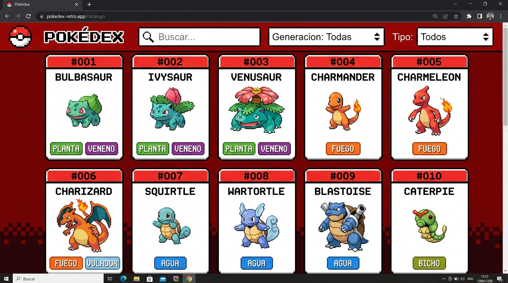
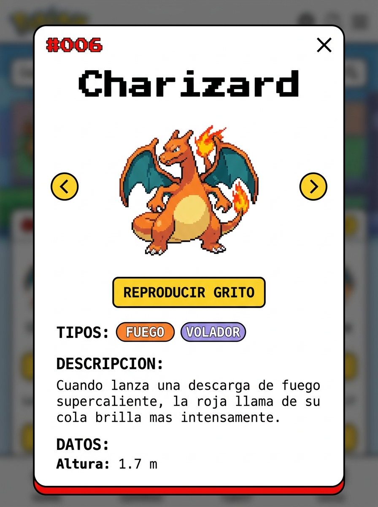
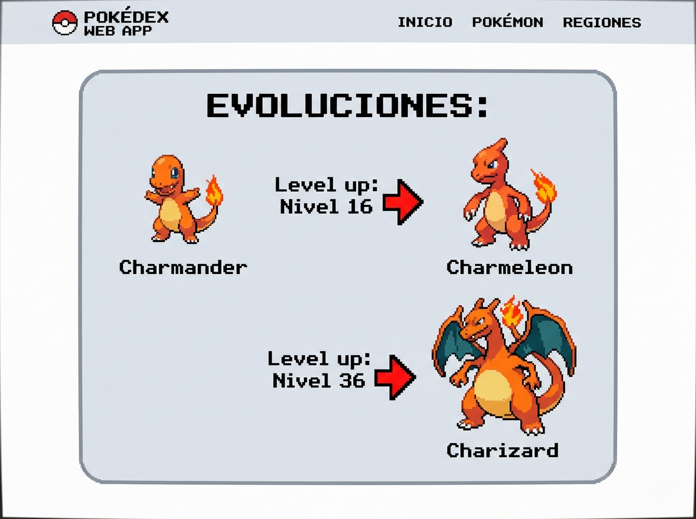

# 🔴 Pokédex Interactiva

<div align="center">


**Pokédex interactiva con catálogo dinámico, filtros por generación y tipo, modal de detalle completo con evoluciones, estadísticas y gritos de Pokémon.**

[Ver Características](#-características-principales) · [Capturas](#️-capturas-de-pantalla) · [Tecnologías](#️-tecnologías-utilizadas) · [Instalación](#-instalación-y-puesta-en-marcha)

</div>

---

## 📋 Descripción del Proyecto

**Pokédex Interactiva** es una aplicación web dinámica que consume la API oficial de Pokémon (**PokeAPI**) para listar, buscar y filtrar información detallada de más de 1000 Pokémon, envuelta en una interfaz de usuario retro con estética _pixel-art_ inspirada en los juegos clásicos de la franquicia.

La plataforma ofrece una experiencia inmersiva con filtrado en tiempo real, carga optimizada en bloques, cadenas de evolución generadas dinámicamente, estadísticas base con barras visuales, descripción oficial en español y reproducción de gritos reales de cada Pokémon.

Desarrollado por **Gustavo Correia**.

---

## 🖼️ Capturas de Pantalla

### 1. Catálogo Principal

> Exploración del catálogo completo con tarjetas retro, filtros por generación (Kanto a Paldea) y tipo, y buscador en tiempo real.



---

### 2. Modal de Detalle — Información y Estadísticas

> Ficha completa con tipos colorizados, descripción oficial en español, altura, peso, habilidades y estadísticas base con barras de progreso visuales. Incluye botón para reproducir el grito real del Pokémon.



---

### 3. Cadena de Evolución

> Línea evolutiva generada gráficamente con sprites en alta definición, indicando el método exacto de evolución (nivel, objetos, intercambio, felicidad, etc.).



---

## 🌟 Características Principales

- **🔍 Búsqueda en Tiempo Real:** Filtrado instantáneo por nombre o ID numérico con sanitización de caracteres especiales.
- **⚡ Filtros Avanzados Combinables:**
  - **Por Generación:** Desde Kanto (Gen 1) hasta Paldea (Gen 9) con rangos de ID específicos por región.
  - **Por Tipo:** Fuego, Agua, Planta, Eléctrico, Psíquico y más, con traducción automática al español.
- **📦 Carga Optimizada por Bloques (Chunks):** Descarga paralela de datos en bloques de 50 Pokémon mediante `Promise.all`, garantizando fluidez sin saturar la API ni el navegador.
- **🎴 Modal de Detalle Completo:** Al hacer clic en cualquier Pokémon se despliega una ventana interactiva con:
  - Estadísticas base (HP, Ataque, Defensa, Ataque Especial, Defensa Especial y Velocidad) representadas con **barras de progreso visuales**.
  - Descripción oficial en español, altura, peso y listado de habilidades (incluyendo ocultas).
  - **Cadena de Evolución Dinámica:** Genera gráficamente la línea evolutiva con sprites HD indicando el método exacto (nivel, objeto, intercambio, felicidad, etc.).
  - **Zonas de Ubicación:** Muestra en qué áreas y versiones de los juegos se puede capturar al Pokémon.
- **🔊 Sistema de Audio Integrado:** Botón para reproducir el **grito real** del Pokémon directamente desde los archivos oficiales de PokeAPI.
- **⬅️ ➡️ Navegación Fluida:** Botones de navegación interna dentro del modal para explorar Pokémon adyacentes sin necesidad de cerrarlo.
- **🚨 Resiliencia a Errores:** Pantalla de error personalizada ante falta de conexión a Internet o caída de la API, con opción de reintentar la carga.
- **📱 Diseño Totalmente Responsivo:** Interfaz adaptada minuciosamente para móviles, tabletas y escritorio mediante CSS Grid y Media Queries.

---

## 🛠️ Tecnologías Utilizadas

| Categoría            | Tecnología / Recurso                                           | Propósito                                                                         |
| :------------------- | :------------------------------------------------------------- | :-------------------------------------------------------------------------------- |
| **Estructura**       | [HTML5](https://developer.mozilla.org/es/docs/Web/HTML)        | Estructuración semántica del catálogo, filtros y modales                          |
| **Estilos**          | [CSS3 Avanzado](https://developer.mozilla.org/es/docs/Web/CSS) | Diseño retro _pixel-art_, variables nativas CSS, animaciones y diseño responsivo  |
| **Fuentes Retro**    | `Pokemon GB` / `Press Start 2P`                                | Tipografías externas para la estética de los juegos clásicos                      |
| **Lógica Principal** | JavaScript ES6+ (Vanilla)                                      | `Fetch API`, `Async/Await`, `Promise.all`, DOM dinámico y arquitectura de eventos |
| **Observer API**     | `MutationObserver`                                             | Inyección correcta de estilos en nodos renderizados dinámicamente en tiempo real  |
| **API de Datos**     | [PokeAPI](https://pokeapi.co/)                                 | Fuente oficial de estadísticas, sprites HD (Official Artwork) y metadatos         |

---

## 📂 Estructura del Proyecto

```text
Pokedex/
├── CSS/
│   └── PokeEstilos.css       # Estilos generales, animaciones y diseño responsivo
├── JS/
│   └── PokeApi.js            # Lógica de peticiones, filtros, paginación y modal
└── HTML/
    └── index.html            # Estructura principal de la aplicación
```
